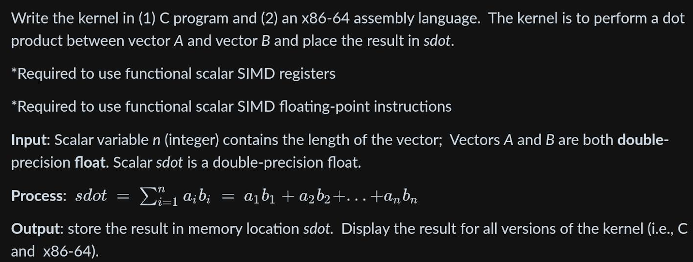
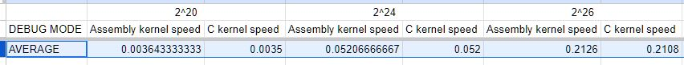
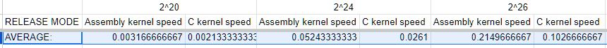
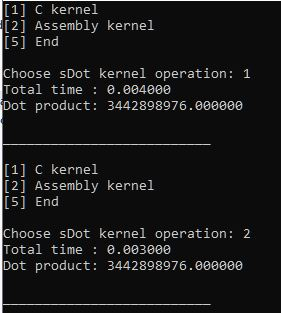
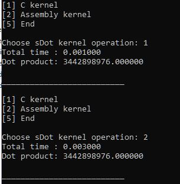
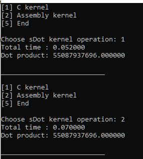
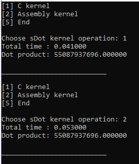
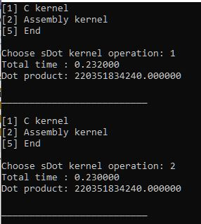
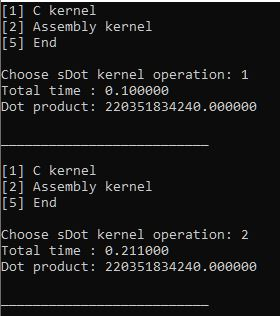

### The program is done under the requirement of LBYARCH’s MP2 with the following specs:

## Directories
### Code
This contains the C and asm files for the dot product program
### Screenshots
This contains the screenshots for the project (both debug and release mode sample pictures)
### VS_Project
This contains the visual studios project space used. When used on other machines, the properties of dotProduct_asm.asm may need to be configured for the nasm path.

## The C Program

The C program allows the calling of both C and assembly kernels. The C program also tracks both the average time and number of execution of each kernel. The value for both vectors is simply a repetition of 0-100 repeatedly until the whole vector is filled out. The sanity check done to see the correctness of both the C and assembly program is if both programs have the same answer. For each sample images, both results are made sure to be the same. 

## Kernel Comparison and Analysis

Link to spreadsheet of calculated times: [Link](https://docs.google.com/spreadsheets/d/1UvPpRS8sQi-n5VUexZrfvCEiLcFy-N6nWYCwjcRaeKk/edit?usp=sharing)

*Debug Mode Average Time Results* 

 *Release Mode Average Time Results* 

The average time is calculated by executing each kernel 30 times (both debug and release mode). The assembly kernel was expected to be faster than the C Program; though, it is slower than the C kernel in both release and debug mode. In debug mode, the C kernel and Assembly kernel were roughly similar in speed, but in release mode, the C kernel was significantly faster than the assembly kernel. This may be because release mode has better optimization in place with its compilation setting ([reference](https://community.st.com/t5/stm32cubeide-mcus/what-is-the-difference-between-debug-and-release-of-a-project/td-p/183634#:~:text=The%20difference%20is%20the%20compiler,unless%20performance%20becomes%20an%20issue.)).

The tests where done with vector sizes 2^20, 2^24, and 2^26. Vector sizes beyond 2^26 are unfeasible due to the computer device lagging and crashing with it.

## Sample Results

### 2^20

### 2^24

### 2^26

